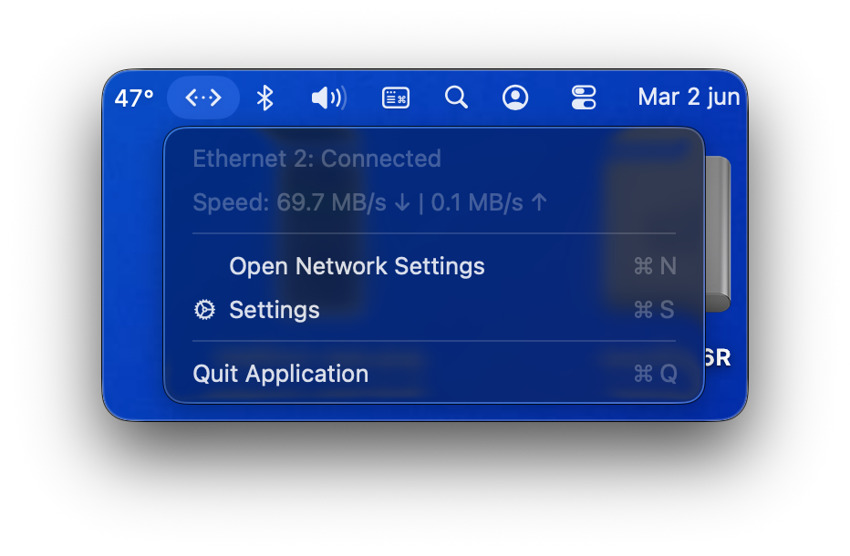
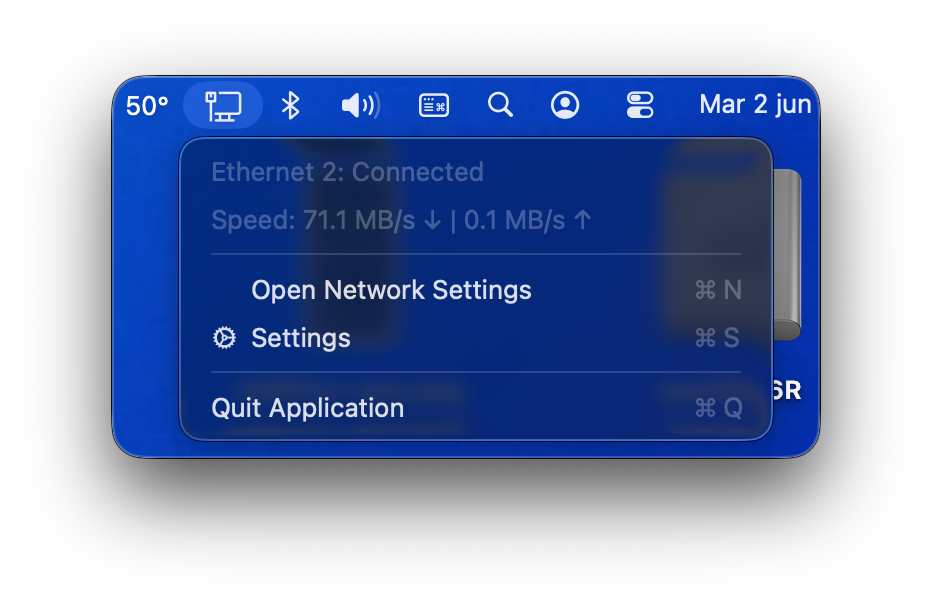
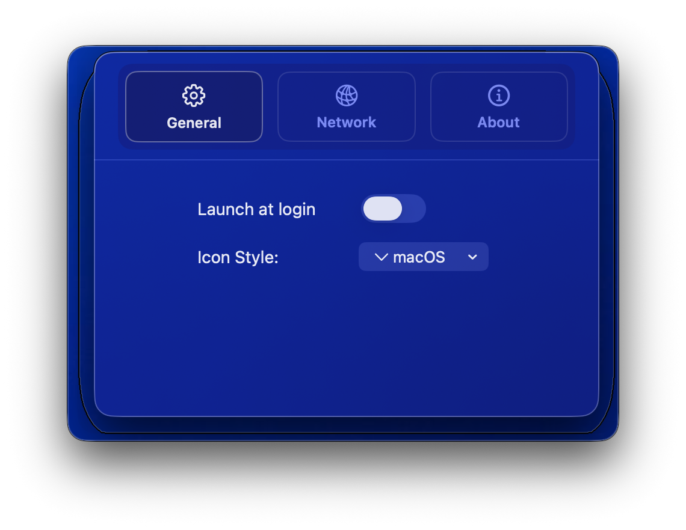
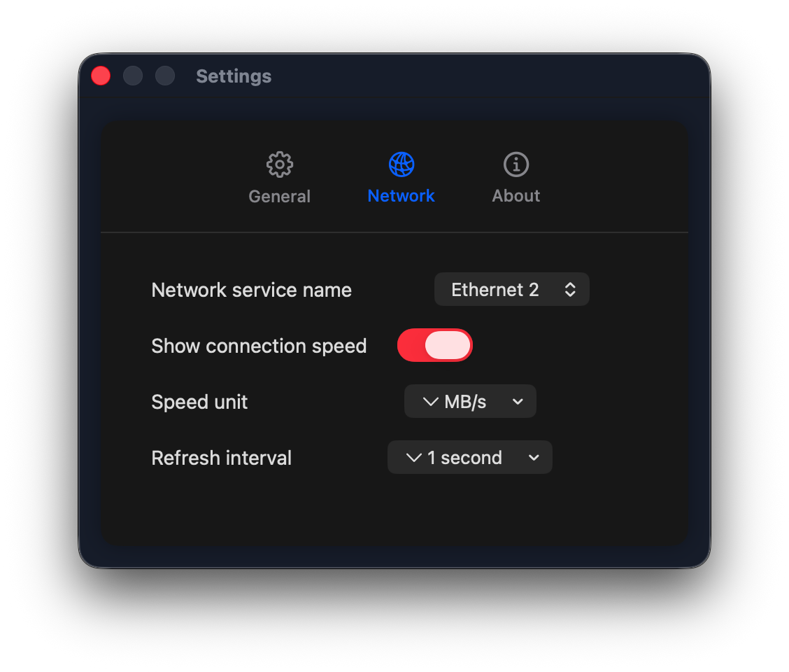

# Easy Ethernet Icon for macOS

A simple and lightweight macOS menu bar application that shows your Ethernet connection status at a glance. Developed by [felixblome](https://github.com/felixblome).

Designed to monitor only the system's Ethernet interface, a setting has been added that allows the user to choose between two Ethernet interfaces:

- `Ethernet` (built-in primary interface)
- `Ethernet 2` (interface created by `Heliport.app` + `itlwm.kext` to use Intel Wi-Fi cards not natively supported by macOS).

You can see [here](DIFFS-WITH-SOURCE-REPO.md) the differences between the source repo and this fork.

## Screenshots

| macOS icon | Windows icon |
| --- | --- |
|  |  |

| General settings | Network settings |
| --- | --- |
|  |  |

## Features

- 🔌 Live ethernet connection status monitoring
- 📊 Live connection speed monitoring 
- 🎯 Choose whether to monitor the `Ethernet` or `Ethernet 2` macOS network service
- 🎨 Choice between macOS and Windows style icons
- 🚀 Launch at Login support
- 💎 Liquid glass style in settings window 

## System Requirements

- macOS 13.5 or newer

## Installation

1. Download the latest release from the releases page
2. Unzip the downloaded file
3. Drag the app to your Applications folder
4. Double click to start the app
5. If the app cannot be opened due to security warnings:
	- Go to System Preferences > Security & Privacy > Scroll down to "Security"
	- Click Open Anyway next to the blocked app
7. (Optional) Click the menu bar icon and select Settings to customize

## Usage

- The icon in the menu bar shows your current Ethernet connection status and (if enabled) the connection speed
- Click the icon to:
  - See connection status
  - See connection speed
  - Access Network Settings
  - Configure app settings
  - Quit the application
- In Settings → Network, choose `Ethernet` for the built-in service or `Ethernet 2` for HeliPort + itlwm setups

## Build from Source

If you want to build the app yourself:

1. Clone this repository
2. Open the project in Xcode
3. Ensure you have Xcode 14 or newer
4. Build the project (⌘B)

## Privacy

This app:

- Only monitors the ethernet connection status

---
Made by [Felix Blome](https://github.com/felixblome/easy-ethernet-icon)
